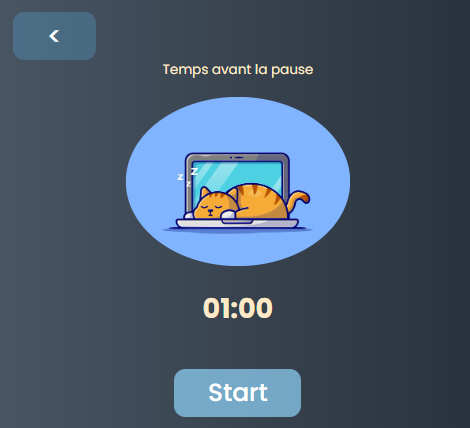

# Extension NeuroPause 🧠

## Présentation
  

NeuroPause est une extension de navigateur conçue pour faciliter les pauses écrans, avec une attention particulière à l'adaptation aux personnes atteintes du syndrome d'Asperger. L'extension propose une fenêtre contextuelle conviviale de taille moyenne, affichant des couleurs douces et apaisantes. Ce design a été élaboré en collaboration avec un infirmier spécialisé dans la prise en charge des personnes atteintes du syndrome d'Asperger, garantissant un environnement qui prend en compte les sensibilités sensorielles.

## Fonctionnalités

- **Fenêtre contextuelle (POPUP)  adaptée à l'Asperger :** La fenêtre contextuelle est conçue dans un souci de simplicité, présentant des couleurs douces et apaisantes pour offrir une expérience utilisateur confortable.

- **Alertes minimales :** Pour minimiser le stress pour les personnes atteintes du syndrome d'Asperger, seul un message d'alerte est affiché ("Ok for a breack?" s'affichant à la fin du timer du temps avant la pause). Cette approche aide à éviter les frustrations potentielles pouvant découler de notifications excessives.

- **Popup qui affiche le temps avant la pause :** Les utilisateurs ont la possibilité de déclencher un minuteur en cliquant sur la durée de la pause. Une fois activé, l'onglet actif est légèrement obscurci, et tous les autres onglets sont floutés. Lorsque l'utilisateur estime que sa pause est achevée, il lui suffit de rafraîchir l'onglet actif, et tous les onglets redeviendront nets. 
=======
- **Popup qui avec temps d'écran personnalisé :** Les utilisateurs peuvent cliquent sur le temps avant la pause et le minuteur se lance puis l'onglet actif se floute et chaque onglet est flouté.Quand l'utilisateur concidère que sa pause est terminée il suffit de raffraichir un onglet et chaque onglet actifs ne sera plus floutés. L'utilisateur peut cliquer sur "N" et faire un clique droit une fois l'extension lancé puis cliquer sur "Options" pour choisir son temps d'écran s'il souhaite le modifier.

=======
- **Popup qui avec temps d'écran personnalisé :** : Les utilisateurs ont la possibilité de déclencher un minuteur en cliquant sur la durée de la pause. Une fois activé, l'onglet actif est légèrement obscurci, et tous les autres onglets sont floutés. Lorsque l'utilisateur estime que sa pause est achevée, il lui suffit de rafraîchir l'onglet actif, et tous les onglets redeviendront nets.
- **Luminosité adaptative :** Une fois le timer lancé, la luminosité de l'écran diminue ou l’écran se floute, signalant à l'utilisateur de faire une pause.

## Mise en route

Pour utiliser NeuroPause, suivez ces étapes :

1. Installez l'extension dans votre navigateur Chrome.
2. Le message d'alerte apparaît après trois heures d'utilisation continue de l'écran.
3. Remplissez la durée de pause souhaitée dans la fenêtre contextuelle.
4. La minuterie de pause démarre, et l'écran s'adapte pour encourager une pause.

## Contexte du Projet

NeuroPause a été développé en étroite collaboration avec un infirmier spécialisé dans le traitement des personnes atteintes du syndrome d'Asperger. Sa contribution a été cruciale pour orienter le développement de l'extension, de la conception à la faisabilité des fonctionnalités, en passant par la présentation, afin de garantir une adaptation optimale aux besoins de la communauté visée.

L'extension minimise la quantité de texte et de variations de couleur, prenant en compte les éventuelles sensibilités sensorielles. Elle vise à créer un outil de soutien pour les personnes qui pourraient trouver difficile de naviguer les applications de pause traditionnelles.

## Contributions et Retours

Nous accueillons les contributions et les retours de la communauté pour améliorer l'utilisabilité et l'efficacité de NeuroPause. N'hésitez pas à ouvrir des problèmes, fournir des suggestions ou contribuer au projet.

**Adapté et développé avec minutie par des étudiantes en développement logiciel [Tijana Laporte Mitrovic, Zoé Lecaille, Domitille Bonnemain]**

[Inclure nos liens ici vers nos profils sociaux pour les retours et les contributions       ]

